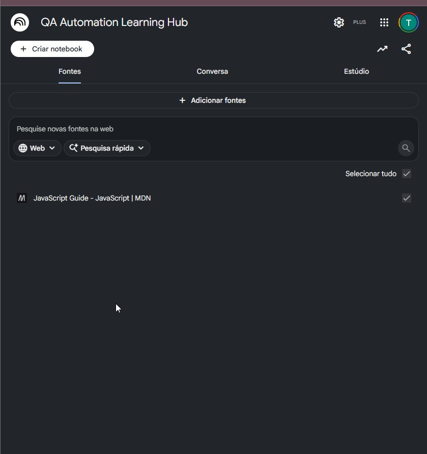
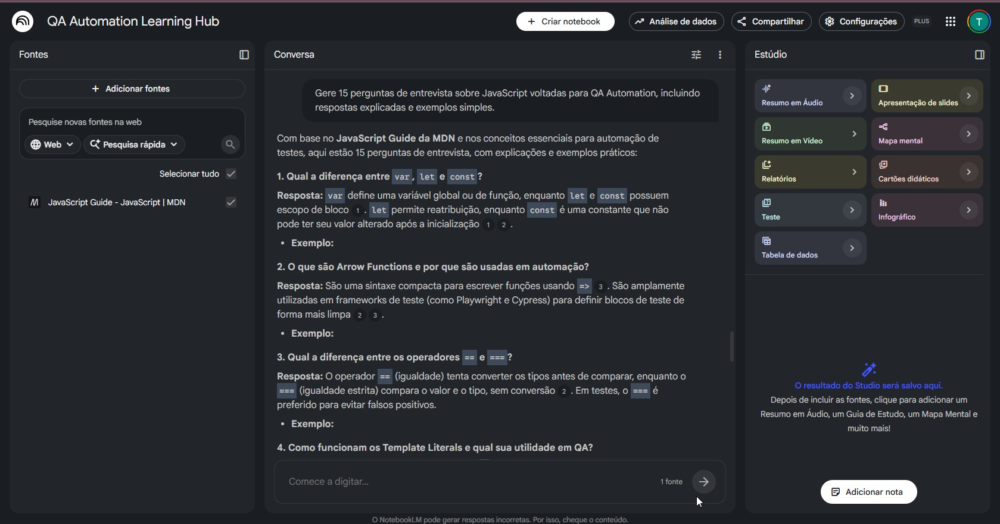
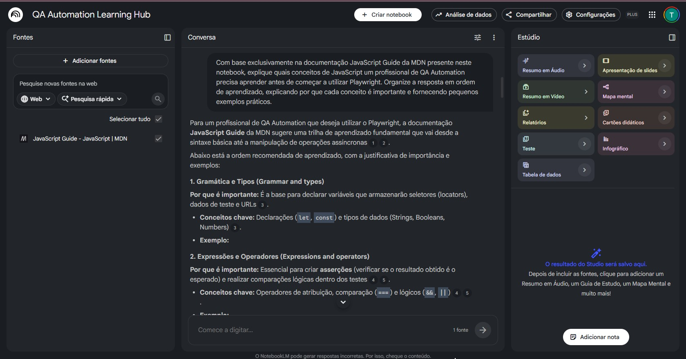
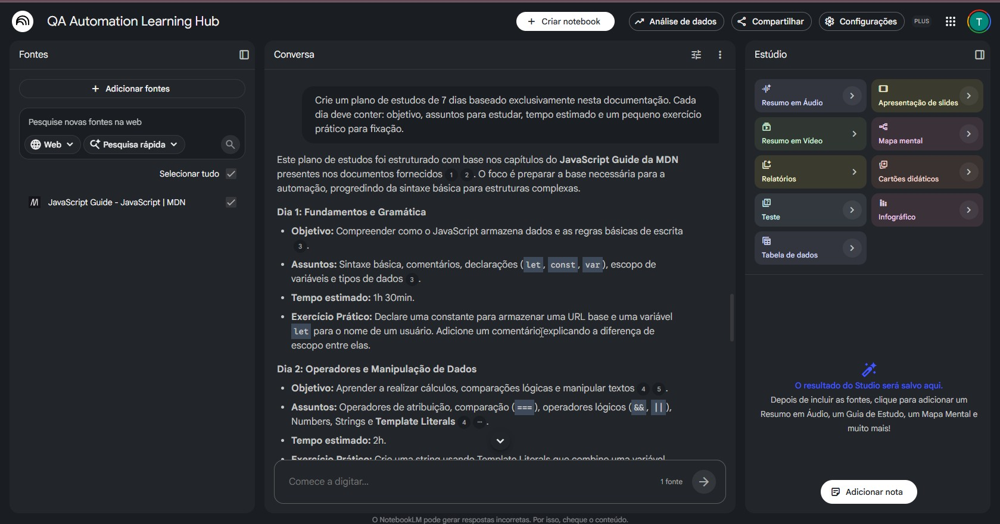

# 📚 QA Automation Learning Hub

> Um projeto de aprendizado contínuo utilizando o **Google NotebookLM** para organizar conhecimento técnico, criar materiais de estudo e acelerar minha evolução como **QA Automation**.

---

## 🎯 Objetivo

Este projeto nasceu durante minha mentoria em QA, mas foi expandido para se tornar um ambiente permanente de estudos.

O objetivo é centralizar conteúdos técnicos, gerar materiais de apoio utilizando Inteligência Artificial e documentar toda a evolução do meu aprendizado em QA Automation.

Em vez de utilizar IA apenas para obter respostas rápidas, a proposta é utilizá-la como uma ferramenta para:

- organizar conhecimento;
- estruturar planos de estudo;
- criar resumos;
- gerar perguntas de entrevista;
- documentar aprendizados;
- construir um portfólio técnico.

---

# 🚀 Tecnologias

| Ferramenta | Finalidade |
|------------|------------|
| NotebookLM | Organização do conhecimento |
| JavaScript | Base para automação |
| MDN Web Docs | Fonte oficial de estudo |
| Git | Versionamento |
| GitHub | Portfólio |
| Markdown | Documentação |

---

# 📖 Fonte utilizada

## JavaScript Guide — MDN Web Docs

Primeira fonte adicionada ao projeto.

A documentação oficial da MDN foi utilizada para compreender os fundamentos do JavaScript necessários para automação de testes utilizando ferramentas como Playwright e Cypress.

---

# 📚 Artefatos produzidos

Nesta primeira versão do projeto foram gerados:

- ✅ Guia dos conceitos fundamentais de JavaScript para QA
- ✅ Plano de estudos de 7 dias
- ✅ Perguntas de entrevista com respostas comentadas

Todos os materiais foram produzidos utilizando exclusivamente a documentação presente no NotebookLM.

---

# 🖼️ Evidências

## Notebook criado

> *(Adicionar um print futuramente)*

---

## Fonte utilizada



---

## Conceitos essenciais



---

## Plano de estudos



---

## Perguntas para entrevistas



---

# 💡 Principais aprendizados

Durante esta primeira etapa foi possível consolidar conhecimentos sobre:

- Sintaxe do JavaScript
- Tipos de dados
- Variáveis
- Escopo
- Operadores
- Estruturas condicionais
- Estruturas de repetição
- Funções
- Arrow Functions
- Template Literals

Além disso, ficou evidente como o NotebookLM pode acelerar a organização do aprendizado sem substituir a leitura da documentação oficial.

---

# 📁 Estrutura do projeto

```text
QA-Automation-Learning-Hub

├── docs/
│
├── images/
│
├── notes/
│
├── prompts/
│
├── LICENSE
│
└── README.md
```

---

# 🛣️ Roadmap

## ✅ Versão 1.0

- [x] Notebook criado
- [x] Primeira fonte adicionada
- [x] Plano de estudos
- [x] Perguntas de entrevista
- [x] Publicação no GitHub

---

## 🔄 Próximas versões

### v1.1

- [ ] Playwright

### v1.2

- [ ] Git e GitHub

### v1.3

- [ ] SQL para QA

### v1.4

- [ ] API Testing

### v1.5

- [ ] Cypress

### v2.0

- [ ] Guia completo para QA Automation

---

# 🤖 Como utilizei Inteligência Artificial

Neste projeto a IA foi utilizada como ferramenta de apoio ao aprendizado.

O NotebookLM foi empregado para:

- organizar documentação técnica;
- criar planos de estudo;
- gerar resumos;
- elaborar perguntas de entrevista;
- facilitar revisões.

Todo o conteúdo gerado foi conferido com a documentação oficial da MDN antes de ser considerado como material de estudo.

---

# 🎯 Próximos objetivos

Este projeto continuará sendo atualizado durante minha jornada de aprendizado em QA Automation.

As próximas fontes incluirão:

- Playwright
- Cypress
- Git
- SQL
- API Testing
- Docker
- CI/CD

Cada nova tecnologia estudada será documentada neste repositório.

---

# 👨‍💻 Autor

**Thiago Moretti**

💼 QA Manual | Estudando QA Automation

GitHub:

https://github.com/thiagomoretti

